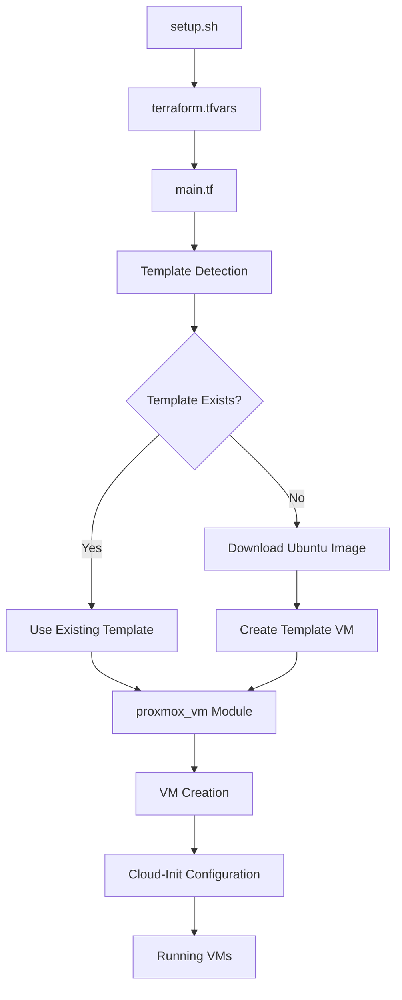

# 🏗️ Terraform Infrastructure Documentation
***README.md AI Created***

> **Proxmox VM Infrastructure as Code - Detailed Technical Documentation**

[](https://terraform.io/)
[](https://proxmox.com/)
[](https://registry.terraform.io/providers/bpg/proxmox)

## 📋 Table of Contents

- [Overview](#overview)
- [Architecture](#architecture)
- [Module Documentation](#module-documentation)
- [Configuration](#configuration)
- [Resources](#resources)
- [Variables](#variables)
- [Outputs](#outputs)
- [Advanced Usage](#advanced-usage)
- [Troubleshooting](#troubleshooting)
- [Examples](#examples)

## 🎯 Overview

This Terraform configuration provides a complete Infrastructure as Code solution for Proxmox VE environments. It features:

- **🔄 Template Management**: Automated Ubuntu cloud template creation and management
- **🖥️ VM Provisioning**: Flexible VM deployment with UEFI support
- **🌐 Cluster Awareness**: Intelligent distribution across Proxmox cluster nodes
- **💾 Storage Management**: Configurable storage pool assignments
- **🔧 Cloud-Init Integration**: Automated VM initialization and configuration

### Key Benefits

- **Reproducible Infrastructure**: Declarative configuration ensures consistent deployments
- **Bandwidth Optimization**: Smart template reuse and preservation capabilities
- **Security First**: Proper storage assignments and UEFI boot configuration
- **Scalability**: Supports both single-node and multi-node cluster deployments

## 🏛️ Architecture

```
terraform/
├── 📄 main.tf                    # Primary infrastructure definition
├── 📄 variables.tf               # Input variable definitions
├── 📄 outputs.tf                 # Output value definitions
├── 📄 versions.tf                # Provider version constraints
├── 📄 terraform.tfvars.example   # Example variable values
├── 🛠️ destroy-preserve-image.sh  # Bandwidth-saving utility script
└── 📁 modules/
    └── 📁 proxmox_vm/            # Reusable VM provisioning module
        ├── main.tf               # VM resource definitions
        ├── variables.tf          # Module input variables
        └── outputs.tf            # Module output values
```

### Data Flow



## 📦 Module Documentation

### proxmox_vm Module

The `proxmox_vm` module is a comprehensive, reusable component for VM provisioning.

#### Features
- **🔧 Flexible Configuration**: Supports standalone and clustered deployments
- **🖥️ UEFI Support**: Modern boot configuration with EFI disk management
- **☁️ Cloud-Init Integration**: Automated user and network configuration
- **📊 Dynamic Scaling**: Configurable VM count and distribution
- **🏷️ Resource Tagging**: Organized resource management

#### Module Inputs

| Variable | Type | Default | Description |
|----------|------|---------|-------------|
| `vm_count` | number | 1 | Number of VMs to create |
| `vm_cpu_cores` | number | 2 | CPU cores per VM |
| `vm_memory` | number | 2 | RAM in GB per VM |
| `vm_disk_size` | number | 20 | Disk size in GB |
| `storage_pool` | string | "ceph-vm" | Storage pool for VM disks |
| `vm_bios_type` | string | "UEFI" | BIOS type (UEFI/BIOS) |
| `pve_clustered` | bool | false | Whether PVE is clustered |
| `vm_distribution` | map(number) | {} | VM distribution per node |

#### Module Outputs

| Output | Description |
|--------|-------------|
| `vm_details` | Complete VM configuration details |
| `vm_ids` | List of created VM IDs |
| `vm_names` | List of VM hostnames |
| `vm_ips` | List of assigned IP addresses |

## ⚙️ Configuration

### Basic Configuration

```hcl
# terraform.tfvars
proxmox_api_url = "https://proxmox.example.com:8006/api2/json"
proxmox_api_user = "terraform@pve!terraform"
proxmox_api_token = "your-secure-token"

# Storage Configuration
storage_pool = "ceph-vm"
template_storage_pool = "truenas"
template_vm_disk_storage = "ceph-vm"

# VM Configuration
vm_count = 3
vm_cpu_cores = 4
vm_memory = 8
vm_disk_size = 50
```

### Cluster Configuration

```hcl
# Clustered Environment
pve_clustered = true
pve_cluster_name = "production"
node_names = ["node1", "node2", "node3"]
node_ips = ["10.0.1.10", "10.0.1.11", "10.0.1.12"]

# VM Distribution
vm_distribution = {
  "node1" = 2
  "node2" = 2
  "node3" = 1
}
```

### Network Configuration

```hcl
# Network Settings
vm_network_bridge = "vmbr10"
vm_network_cidr = "10.10.0.0/24"
vm_starting_ip = "10.10.0.100"
vm_gateway = "10.10.0.1"
```

## 🔧 Resources

### Primary Resources

#### 1. Ubuntu Cloud Image Download
```hcl
resource "proxmox_virtual_environment_download_file" "ubuntu_cloud_image" {
  content_type = "iso"
  datastore_id = var.template_storage_pool
  url = var.ubuntu_image_url
  overwrite_unmanaged = true
}
```

#### 2. Template VM Creation
```hcl
resource "proxmox_virtual_environment_vm" "ubuntu_template" {
  name = var.template_name
  template = true
  bios = "ovmf"  # UEFI support
  
  efi_disk {
    datastore_id = var.template_vm_disk_storage
    file_format = "raw"
  }
}
```

#### 3. VM Module Invocation
```hcl
module "proxmox_vms" {
  source = "./modules/proxmox_vm"
  
  # Configuration parameters
  storage_pool = var.storage_pool
  vm_bios_type = var.vm_bios_type
  # ... additional parameters
}
```

### Data Sources

#### Node Discovery
```hcl
data "proxmox_virtual_environment_nodes" "available_nodes" {}
```

#### Template Detection
```hcl
data "proxmox_virtual_environment_vms" "template_search" {
  for_each = toset(data.proxmox_virtual_environment_nodes.available_nodes.names)
  node_name = each.key
}
```

## 📊 Variables

### Core Variables

#### Proxmox Connection
```hcl
variable "proxmox_api_url" {
  description = "Proxmox API URL"
  type        = string
}

variable "proxmox_api_user" {
  description = "Proxmox API user"
  type        = string
}

variable "proxmox_api_token" {
  description = "Proxmox API token"
  type        = string
  sensitive   = true
}
```

#### Infrastructure Configuration
```hcl
variable "pve_clustered" {
  description = "Whether PVE is clustered"
  type        = bool
  default     = false
}

variable "node_names" {
  description = "List of node names"
  type        = list(string)
  default     = []
}
```

#### VM Configuration
```hcl
variable "vm_cpu_cores" {
  description = "Number of CPU cores per VM"
  type        = number
  default     = 2
}

variable "vm_memory" {
  description = "RAM size in GB"
  type        = number
  default     = 2
}

variable "vm_bios_type" {
  description = "BIOS type (UEFI, BIOS)"
  type        = string
  default     = "UEFI"
}
```

### Storage Variables
```hcl
variable "storage_pool" {
  description = "Storage pool name for VM disks"
  type        = string
  default     = "ceph-vm"
}

variable "template_storage_pool" {
  description = "Storage pool for template downloads"
  type        = string
  default     = "truenas"
}
```

## 📤 Outputs

### Infrastructure Summary
```hcl
output "infrastructure_summary" {
  description = "Complete infrastructure overview"
  value = {
    deployment_type = var.pve_clustered ? "Clustered" : "Standalone"
    total_nodes = length(var.node_names)
    total_vms = sum(values(local.vm_distribution))
    storage_pool = var.storage_pool
  }
}
```

### VM Details
```hcl
output "vm_details" {
  description = "Detailed VM information"
  value = module.proxmox_vms.vm_details
}
```

### Connection Information
```hcl
output "connection_info" {
  description = "VM connection details"
  value = {
    ssh_username = var.vm_username
    ssh_command_examples = [
      for ip in module.proxmox_vms.vm_ips :
      "ssh ${var.vm_username}@${ip}"
    ]
  }
}
```

## 🚀 Advanced Usage

### Custom Template Configuration

```hcl
# Use a different Ubuntu version
ubuntu_version = "jammy"
ubuntu_image_url = "https://cloud-images.ubuntu.com/jammy/current/jammy-server-cloudimg-amd64.img"

# Custom template settings
template_name = "ubuntu-jammy-docker-template"
template_id = 9001
```

### Multi-Environment Setup

```hcl
# Production Environment
locals {
  environment = "production"
  
  vm_config = {
    production = {
      vm_count = 10
      vm_cpu_cores = 8
      vm_memory = 16
      vm_disk_size = 100
    }
    staging = {
      vm_count = 3
      vm_cpu_cores = 4
      vm_memory = 8
      vm_disk_size = 50
    }
  }
}

# Dynamic configuration based on environment
vm_count = local.vm_config[local.environment].vm_count
vm_cpu_cores = local.vm_config[local.environment].vm_cpu_cores
```

### GPU Passthrough Preparation

```hcl
# VM tags for GPU nodes
vm_tags = "terraform,gpu-ready,production"

# Specific node targeting for GPU VMs
vm_distribution = {
  "gpu-node-1" = 2  # VMs with GPU access
  "cpu-node-1" = 3  # Standard VMs
}
```

## 🔧 Troubleshooting

### Common Issues and Solutions

#### Issue: Storage Pool Not Found
```bash
# Error: storage 'local-lvm' does not exist
# Solution: Update storage configuration
storage_pool = "your-actual-storage-pool"
```

#### Issue: Template Already Exists
```bash
# Check existing templates
terraform import proxmox_virtual_environment_vm.ubuntu_template node/vm-id
```

#### Issue: UEFI Boot Problems
```bash
# Ensure proper EFI configuration
vm_efi_disk = true
vm_bios_type = "UEFI"
vm_machine_type = "q35"
```

#### Issue: Bandwidth Optimization
```bash
# Use the preserve script for teardown
./destroy-preserve-image.sh

# Or target specific resources
terraform destroy -target="module.proxmox_vms"
```

### Debug Commands

```bash
# Enable Terraform debugging
export TF_LOG=DEBUG
export TF_LOG_PATH=./terraform.log

# Validate configuration
terraform validate

# Plan with detailed output
terraform plan -out=tfplan
terraform show tfplan

# Apply with auto-approve (use cautiously)
terraform apply -auto-approve

# Check state
terraform show
terraform state list
```

## 📚 Examples

### Example 1: Single VM Deployment
```hcl
# Minimal configuration for one VM
vm_count = 1
vm_cpu_cores = 2
vm_memory = 4
vm_disk_size = 30
storage_pool = "local-lvm"
```

### Example 2: Multi-Node Cluster
```hcl
# Cluster with 6 VMs across 3 nodes
pve_clustered = true
node_names = ["pve1", "pve2", "pve3"]
vm_distribution = {
  "pve1" = 2
  "pve2" = 2
  "pve3" = 2
}
```

### Example 3: Development Environment
```hcl
# Lightweight development setup
vm_count = 2
vm_cpu_cores = 2
vm_memory = 4
vm_disk_size = 25
vm_hostname_prefix = "dev"
vm_tags = "development,testing"
vm_start_on_boot = false
```

### Example 4: Production Cluster
```hcl
# Production-ready configuration
vm_count = 15
vm_cpu_cores = 8
vm_memory = 32
vm_disk_size = 200
storage_pool = "ceph-vm"
vm_protection = true
vm_start_on_boot = true
vm_tags = "production,critical"

# High availability distribution
vm_distribution = {
  "pve-prod-1" = 5
  "pve-prod-2" = 5
  "pve-prod-3" = 5
}
```

## 🔗 Related Documentation

- **[Main Project README](../README.md)**: Overall project documentation
- **[Ansible Documentation](../ansible/README.md)**: Post-deployment configuration
- **[Proxmox Provider Documentation](https://registry.terraform.io/providers/bpg/proxmox)**: Official provider docs
- **[Terraform Documentation](https://terraform.io/docs)**: Terraform core documentation

---

<div align="center">

**[⬆ Back to Top](#️-terraform-infrastructure-documentation)**

*Infrastructure as Code for Proxmox VE*

</div>
